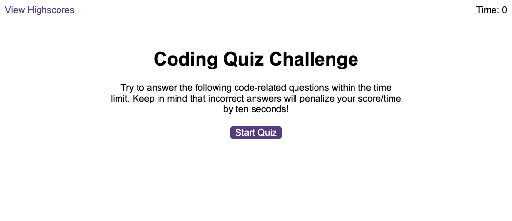
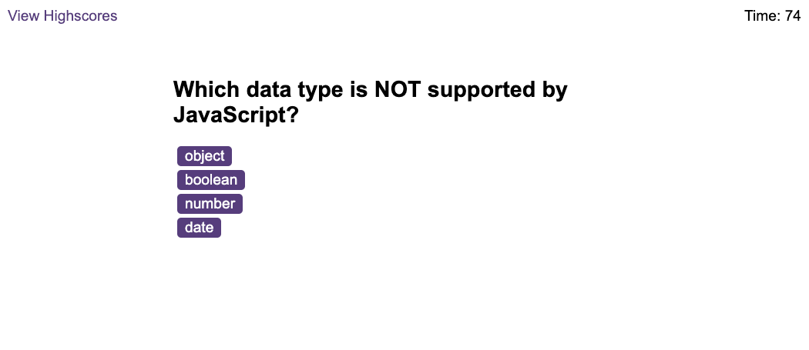
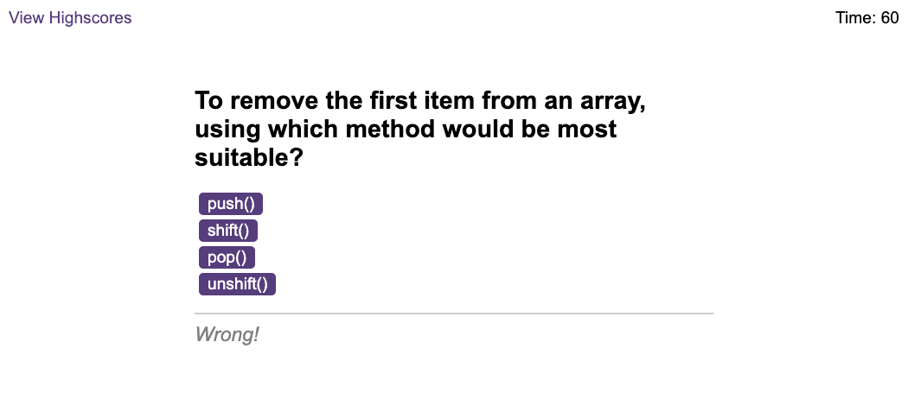
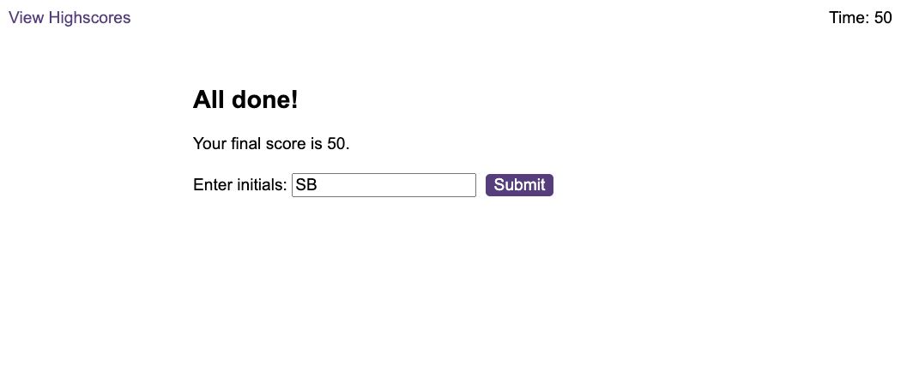
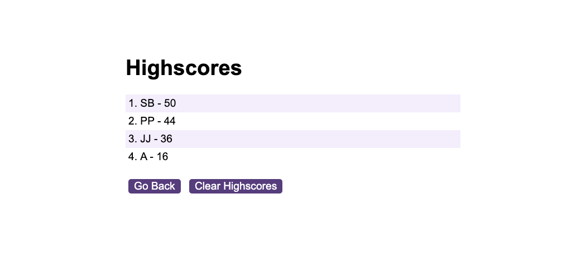

# Unit 6 Challenge: Code Quiz

## Description

A timed coding quiz with multiple-choice questions on JavaScript fundamentals.

The user is presented with a series of questions in timed conditions. The score is determined by how much time is left remaining when the last question is answered, but be warned any incorrect answer deducts 10 seconds from the timer!

This quiz was built to help further my understanding of how to:
- use a browser's Web API to grab HTML elements and place data into it
- trigger functions within event listeners to help add interactivity to a webpage
- store data on the client side in local storage

## Installation

N/A

## Usage

The quiz can be accessed from the link below.

https://inquisitive-druid-fc2233.netlify.app/

The user will be given some instructions and invited to click a button to start the quiz.

When the quiz is started, a timer begins, which is shown in the top right of the screen, and the user is presented with the first question and multiple choice answers.

When the user clicks on an answer, they are directed to the next question. If they answer correctly, they are given feedback on the bottom saying they got it correct (as well as a suitable sound!). If they answer incorrectly they get feedback they got it wrong, and more importantly 10 seconds is deducted from the timer.

This continues until the last question is answered, at which point the user's score is shown along with an invitation to log this score with their initial to a leaderboard of high scores.

If their score is submitted, the user is taken to a new page that shows the leaderboard. This page can also be accessed by the 'View Highscores' link in the top left of the main webpage. The leaderboard scores can be cleared by clicking on the 'Clear Highscores' button.

> **Warning**: the quiz includes annoying feedback sounds (at least in my opinion!). So users might need to turn down or mute their volume before starting!

## Credits

As per usual, [Stack Overflow](https://stackoverflow.com) posts via [Google](https://google.com). I can't credit individual posts because I broke my browser while trying a for loop which meant I closed all tabs.

While doing the work and challenge this week I also learnt about, briefly used, and was just generally all-round amazed by [ChatGPT](https://chat.openai.com) ([Guardian article](https://www.theguardian.com/technology/2022/dec/04/ai-bot-chatgpt-stuns-academics-with-essay-writing-skills-and-usability)). Will Stack Overflow soon be a thing of a past??

The HTML and CSS were provided by the course and not created by myself.

## License

Licensed under the [MIT](https://opensource.org/licenses/MIT) license.

## Badges

